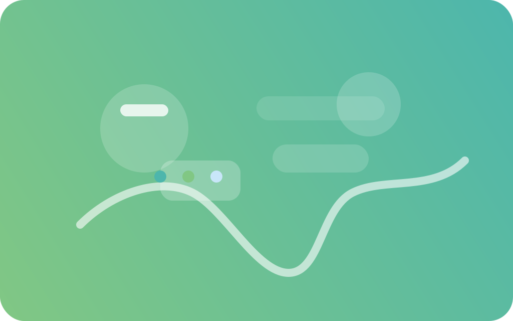

# Alexander Zhan — Pastel Forest Portfolio

Anime-inspired vertical journey that guides visitors from sky to roots through Alexander Zhan’s technical and creative projects.



## ✨ Highlights

- Scroll-linked parallax world spanning sky, mountains, canopy, river, and roots
- Anime.js environmental effects: drifting clouds, fireflies, waterfalls, river ripples, and gentle leaf sweeps
- Randomized project showcase that picks a fresh layout (rafts, cube, carousel, constellation, or cards) on every visit
- Mobile-first design with hover blooms, accessibility-friendly skip link, and reduced-motion fallback

## 🛠️ Tech Stack

- React + TypeScript (Vite)
- TailwindCSS for utility styling
- anime.js for environmental motion
- Framer Motion for scroll-bound choreography
- React Icons for skill logos

## 🚀 Getting Started

```bash
npm install
npm run dev
```

- Dev server runs at http://localhost:5173
- Build for production with `npm run build`
- Preview the production bundle locally via `npm run preview`

## 🗂️ Project Data & Assets

- Project entries live in `src/data/projects.json`. Update this file only—components read from it automatically.
- Custom illustrations for each project are in `public/images/`. Replace the SVGs with your own assets if desired (keep filenames consistent).
- Contact information is configured in `Contact` section (`src/components/sections/Contact.tsx`).

## 🧭 Section Overview

| Layer | Component | Notes |
|-------|-----------|-------|
| Sky | `Hero` | Gradient time-of-day shifts, floating call-to-action clouds |
| Mountains & Waterfalls | `About`, `Skills` | Mist, waterfall gradients, skill blooms |
| Forest Canopy | `Experience` | Tree-trunk timeline with glowing branches |
| Forest Floor & River | `Projects` | Randomized layout via `ProjectShowcase` |
| Roots & Ground | `Contact` | Ripple + leaf sweep animations with contact links |

## ♿ Accessibility & Motion

- Skip link jumps directly to the hero section for keyboard users.
- `prefers-reduced-motion` automatically creates a static experience by minimizing animations.
- Smooth scrolling enabled on browsers that support it.

## ☁️ Deployment (Vercel)

1. Push the project to a GitHub repository (`git init` → initial commit → `git remote add origin` → `git push`).
2. Import the repository into Vercel.
3. Use the default Vite build command (`npm run build`) and output directory (`dist`).

## 🤝 Credits

Design and implementation by Alexander Zhan — blending engineering rigor with soft forest atmospheres. Feel free to adapt the palette and sections for future co-op seasons or new projects.
